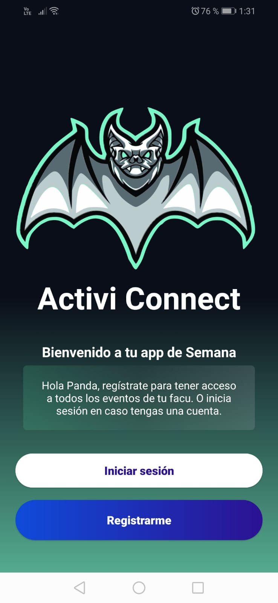
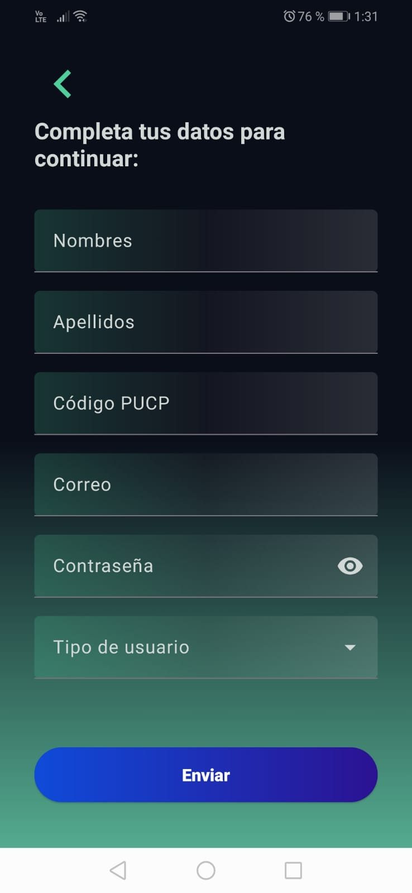
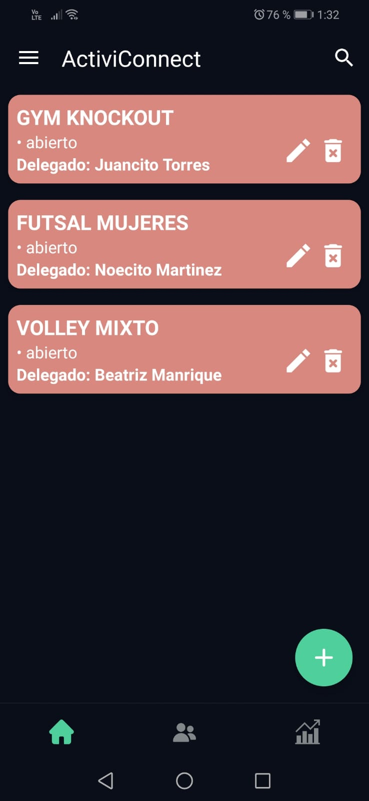
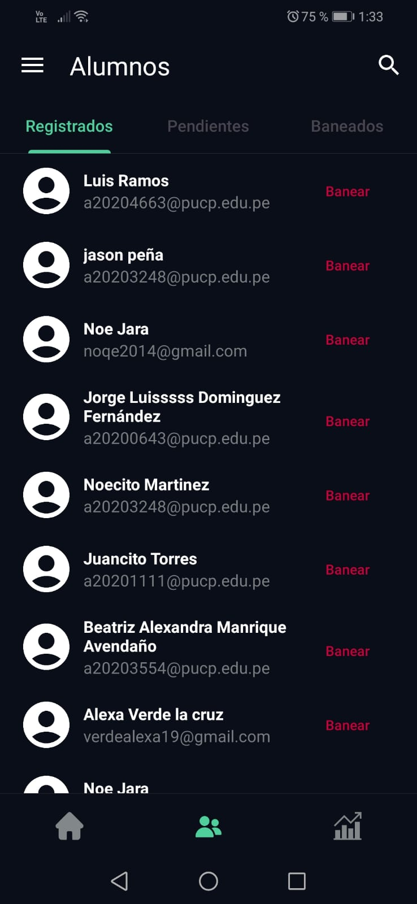
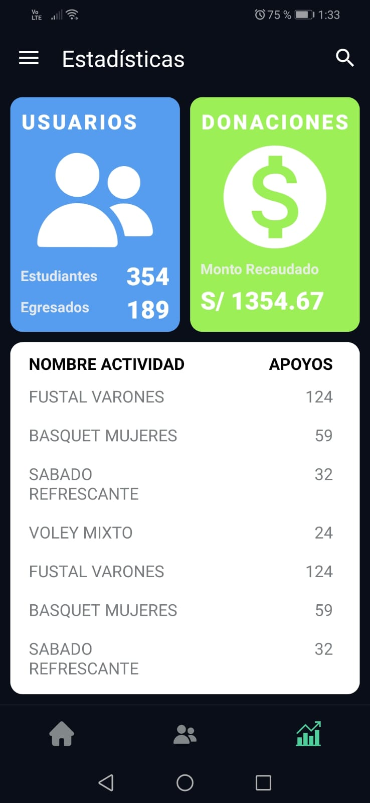
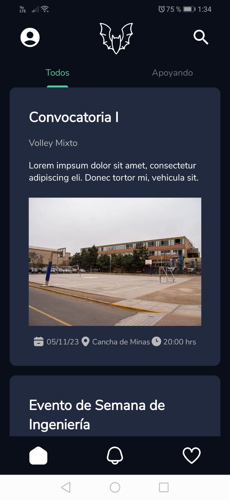
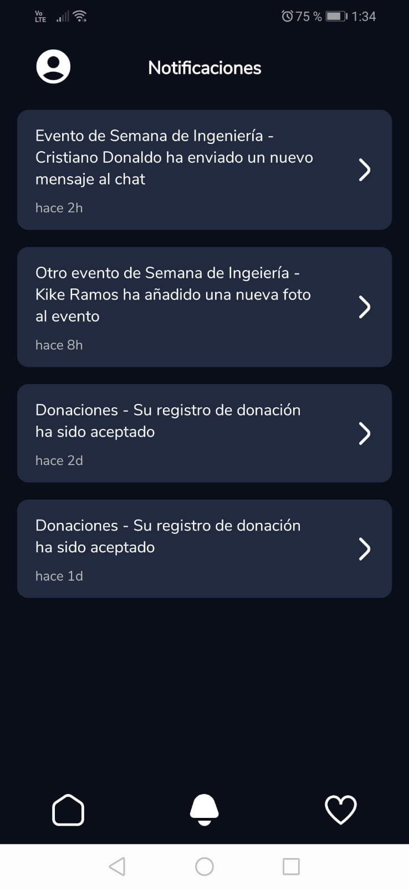
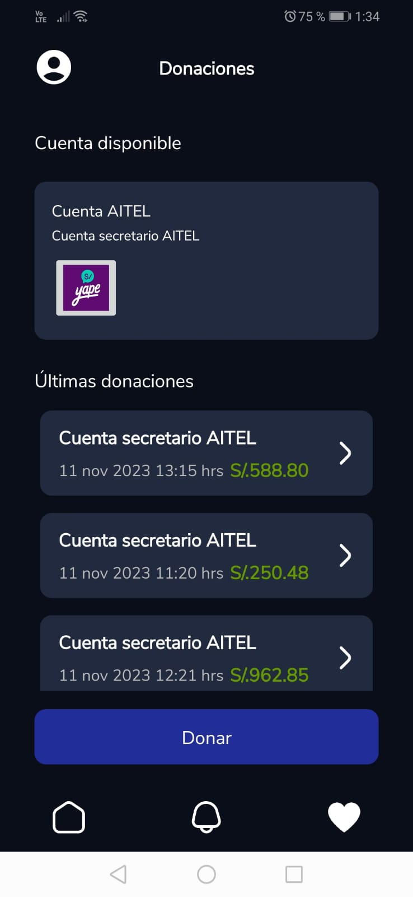

# App-Gestion-Actividades
Una aplicación para la gestión de personal y eventos en semana de ingeniería que permite 
gestionar los alumnos que apoyarán en la semana de ingeniería 2023 y cómo organizarlos de una manera efectiva.

  
  
  
  
  
  
  
  
 

